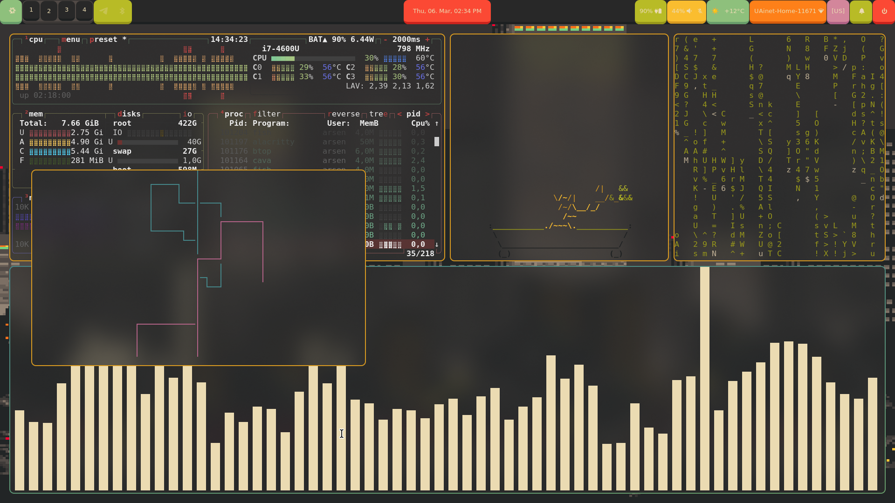

# ❄ myNixOS
DISCLAMER! This rice is not completed.


Welcome to my Configuration! This is my FIRST rice and i hope you like it.

# 💻 Soft
- **Window manager** <- hyprland
- **Font** <- Meslo nerdfont
- **App launcher** <- rofi(wayland)
- **Status bar** <- waybar
- **Shell** <- fish with starship
- **Terminal** <- alacritty
- **Text editor** <- neovim(nixvim)
- **Widgets** <- Ags(but now i dont use it) 
- **Fetch** <- Fastfetch
- **Wallpaper tool** <- swww
- **Lock screen** <- hyprlock(but i replace one on swaylock)
- **Browser** <- Firefox
- **Music player** <- Youtube Music
- **The other programs** <- cbonsai, cmatrix, pipes.sh, cava, tty-clock 
- **Top** <- btop

# 🚀 Installation

Lets cut out unnecessary words and start the installation 

1. **Install NixOS** -> if you haven't installed NixOS yet. Follow [that](https://nixos.org/manual/nixos/stable/#sec-installation)

2. **Clone the repository** ->
    ```bash 
    git clone https://github.com/tluwun/myNixOS
    cd myNixOS
    ```
3. **Change the hostname and username in flake.nix**

4. **Copy hardware-configuration.nix to nixos** ->
    ```bash
    cp /etc/nixos/hardware-configuration.nix nixos/
    ```
5. **Rebuild Configuration** ->
    ```bash 
    sudo nixos-rebuild boot --flake . && home-manager switch --flake .
    ```
# ⭐ End



Enjoy 🌟
