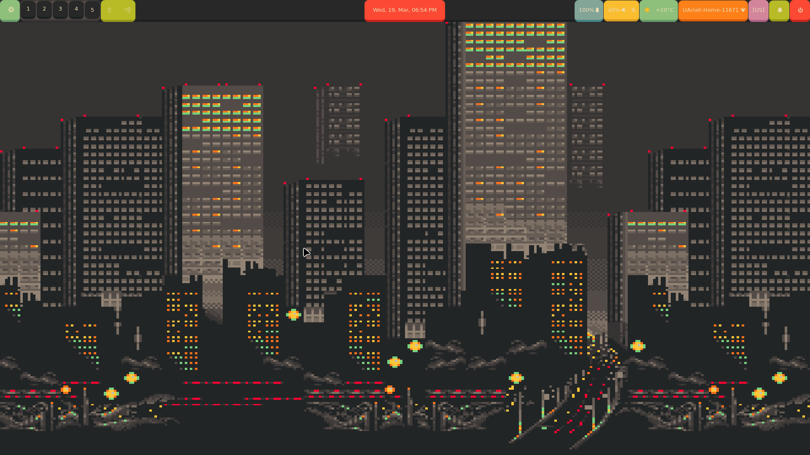
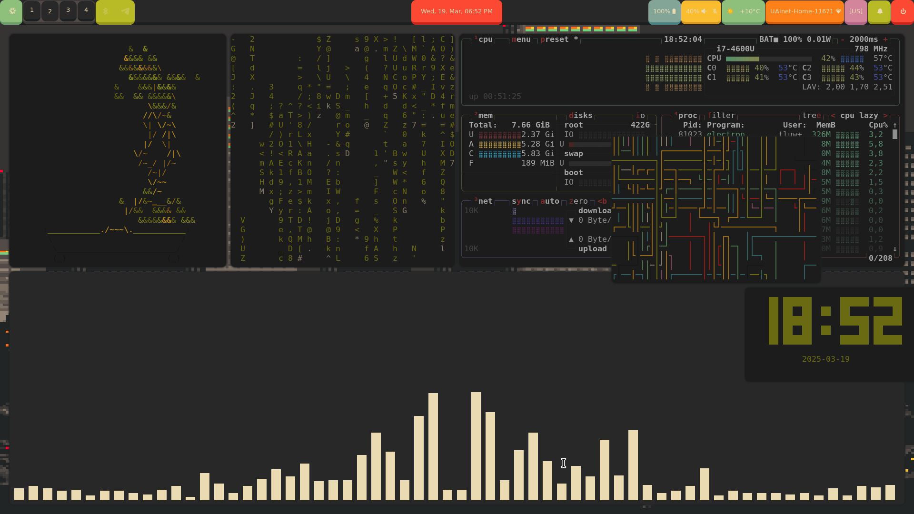

# ❄ myNixOS

Welcome to my Configuration! This is my FIRST rice and i hope you like it.

# 💻 Soft
- **Window manager** <- hyprland
- **Font** <- JetBrainsMono Nerd font
- **App launcher** <- rofi(wayland)
- **Status bar** <- waybar
- **Shell** <- fish with starship
- **Terminal** <- alacritty
- **Text editor** <- neovim(nixvim)
- **Widgets** <- none
- **Fetch** <- Fastfetch
- **Wallpaper tool** <- swww
- **Lock screen** <- hyprlock
- **Browser** <- Firefox
- **Music player** <- Cmus 
- **The other programs** <- cbonsai, cmatrix, pipes.sh, cava, tty-clock 
- **Top** <- btop

# 🚀 Installation
Lets cut out unnecessary words and start the installation 

1. **Install NixOS** -> if you haven't installed NixOS yet then follow [that](https://nixos.org/manual/nixos/stable/#sec-installation)

2. **Clone the repository** ->
    ```bash
    git clone https://github.com/tluwun/myNixOS
    cd myNixOS
    ```
3. **Copy hardware-configuration.nix to nixos** ->
    ```bash
    cp /etc/nixos/hardware-configuration.nix nixos/
    ```
4. **Rebuild Configuration** ->
    ```bash 
    sudo nixos-rebuild boot --flake ./#yourhostname && home-manager switch --flake ./#yourusername
    ```
5. **change in flake.nix username and hostname**
    ```bash
        nixosConfiguration.yourhostname = nixpkgs.lib.nixosSystem = { #change in this line hostname
        homeConfigurations.yourusername = home-manager.lib.homeManagerConfiguration {
    ```
# ⭐ End



Enjoy 🌟
